# RTS Description

## reference

《rts项目-概要设计说明书.docx》

《实时排程系统RTS基础培训.pptx》

## 1 项目需求

产品： 实时生产调度引擎（RTS）

用途：每间隔十五分钟，RTS对工厂实时生产数据捞取、处理，并经过引擎计算后，输出未来24小时的机器生产调度结果，并且能够通过调整参数来灵活达到业务偏好，最终达到自动化派送，搬送指导，退port指导等需求。

RTS需求定义：

从工厂获取实时生产数据；

实时数据生成仿真实体；

离散事件仿真算法；

业务偏好权重算法；

指定数据输出。

**术语和缩略语**

| **术语和缩略语** | **描述**                                                               |
| ---------------------- | ---------------------------------------------------------------------------- |
| RTS                    | 实时生产调度                                                                 |
| Mask                   | 面板生产时使用的光罩                                                         |
| Inline                 | 单线生产设备                                                                 |
| Parallel Chamber       | 多腔室生产设备                                                               |
| Lot                    | 生产的一个批次，排程单位                                                     |
| move信息               | 反映生产线各个站点未来的Move情况                                             |
| WIP信息                | 反映一个班次各个站点已发生的时间段内的WIP信息和未发生的时间段内预测的wip信息 |

## 2 RTS 作用与架构

### 2.1 系统作用

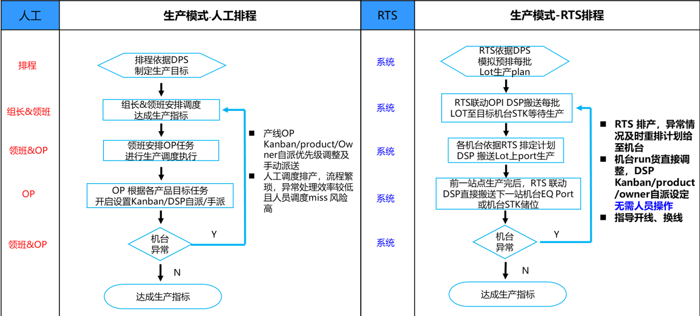

输入：1.产品 2.机台 3.站点及Flow 4.TT、TAT等 5.禁限Run …

处理： 1.生产策略（各机台的计算因子配置） 2.排产计算

输出：1.未来1天各Lot各未完工的主站点的机台计划

### 2.2 系统架构

下图为RTS项目整体技术架构：RTS项目整体包含两大模块，业务模块和流程控制模块，业务模块主要实现工厂生产相关的逻辑业务，流程控制模块主导整个仿真系统。两大模块又分为数个子模块：数据模型模块，引擎在仿真中需要用到的实体，他们的状态变化表示了真实工厂中的状态变化；事件模拟模块，在整个仿真过程中，处理旧事件，生成新事件，使事件循环进行下去以达到仿真目的；工艺路径模块，负责构建模拟生产中的工艺路径；公用帮助模块，用于快速构建KEY值，获取默认配置值，加快快发速度；多线程处理模块，在程序运行中，对部分函数进行多线程数据处理，提升效率；仿真实体扩展数据处理模块，当一些实体无法达成需求开发要求时，对其进行扩展的模块；IP推演统计模块，在仿真过程中对WIP进行实时推演，来统计过程中结果是否符合需求，并利用中间结果，可以开发一些其他定制需求；输入模块，对获得的数据进行缓存和生成实体的模块；仿真控制模块，构建整个仿真的事件处理逻辑，对实体状态进行修改，以及权重控制；定制业务模块，根据工厂的客制化开发需求，将需求分类放在不同文件下进行处理，并将其使用在控制模块中；输出模块，对整个仿真过程中产生的数据结果进行缓存，处理，并传输；倒推模块，对计划倒推成每个时间节点需要完成的目标，对仿真中的权重控制进行参考；

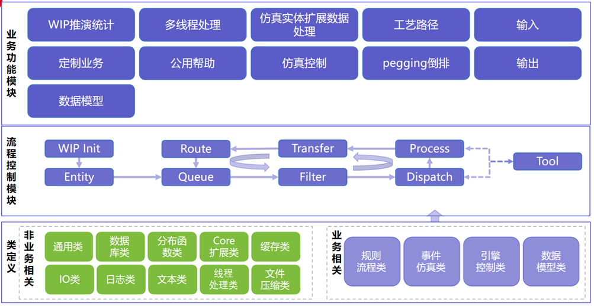

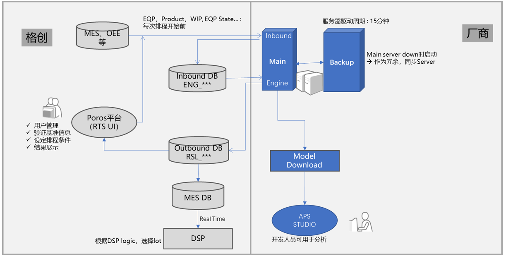

### 2.3 排产机制

•模拟产品如何在产线中推移的真实情况， 主要关注在机台的上port和退port

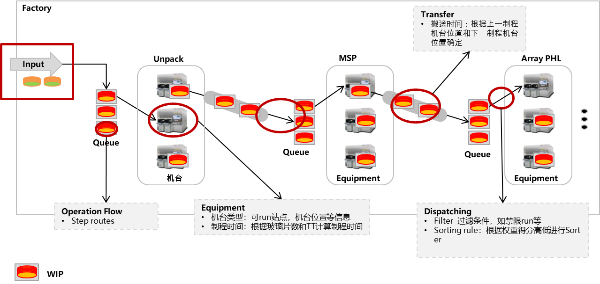

### 2.4 排程原理

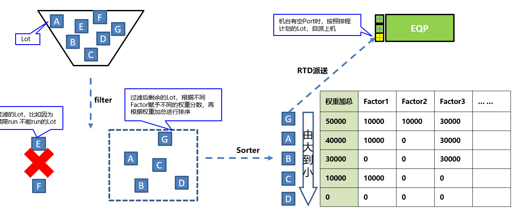

### 2.5 权重设计

此文档中出现的score的意义为表示0~1，Factor weight的意义为权重值。例 权重得分：score * weight = 0.5 * 10,000 = 5,000

Factor Weight为1或0，代表此Factor是Fiter，其中1代表生效，0代表不生效。Criteria在权重详情界面有描述

| **分类**   | **Factor  ID**                     | **Description**                                                                         | **Factor  Weight** | **Criteria** |
| ---------------- | ---------------------------------------- | --------------------------------------------------------------------------------------------- | ------------------------ | ------------------ |
| 防止机台IDLE     | LOT_LOCATION_PRIORITY                    | 针对Wip中的Wait  Lot，  如果位置在机台的相邻STK上，则得分                                     | 10,000                   | -                  |
| 机台分配         | LAYER_BALANCE_PRIORITY                   | 对于可以跑不同层别的机台，根据不同层别的WIP数量的多少决定机台去跑哪个层别                     | 30,000.00                | -                  |
| 机台分配         | REQUIRED_EQP_PRIORITY                    | 根据WIP数量判断需要机台数量，某只产品WIP数量越多，所需机台越多，得分越高                      | 30,000.00                | 2                  |
| 机台分配         | LAYER_BALANCE_FOR_PHOTO                  | 针对于PHL前站点的机台设置的不同层别平衡的权重，类似于Layer  Balance Priority                  | 1                        | 1                  |
| 满足瓶颈run货    | NEXT_STEP_RUN_PRIORITY                   | 依据一下站点run货情况来给优先级                                                               | 100,000                  | -                  |
| 满足瓶颈run货    | NEXT_STEP_CONTINUOUS_PRODUCTION_PRIORITY | 下一PHL站点的Wip状况的权重，优先保证PHL  Run货                                                | 100,000.00               | 3                  |
| 切换线           | ALLOW_RUN_DOWN_TIME                      | 机台可以IDLE等前面WIP到站，减少切换线                                                         | 1                        | 2                  |
| 切换线           | MASK_MOVE_PREVENT_PRIORITY               | 阻止Mask切换权重，如果排的Lot不需要切换Mask，则得分，需要切换Mask则不得分                     | 0                        | -                  |
| 切换线           | MIN_MOVEQTY_PRIORITY                     | 机台最小Move数量，如果机台已连续run超过维护的机台最小Move数量，则不得分，否则得分；减少切换线 | 100,000.00               | 200                |
| 切换线           | PREVENT_LAYER_CHANGE_PRIORITY            | 对于可以跑不同层别的机台，如果需要切层别则不得分                                              | 0                        | -                  |
| 切换线           | SETUP_PRIORITY                           | 如果不需要切换线小于要作业的时间，则得分                                                      | 30,000.00                | -                  |
| 切换线           | SETUP_TIME_PRIORITY                      | 如果切换线时间小于设定值，则得分                                                              | 30,000.00                | 10                 |
| 切换线           | MAX_MOVE_LIMIT_PRIORITY                  | 机台最大Move数量，如果机台已连续run超过维护的机台最大Move数量，则不得分，否则得分；           | 0                        | 1,000              |
| 尾批快跑         | SMALL_BATCH_MERGE_PRIORITY               | 针对尾批如果落后主货批设定的站点数量，则得分                                                  | 0                        | 100;3              |
| 优先run          | LOT_PRIORITY                             | 关于Lot  priority的优先级，2等级得分最高，3等级次之，5等级不得分                              | 30,000.00                | -                  |
| 优先run          | OWNER_TYPE_PRIORITY                      | 和特定的OwnerType一样的情况给与较高优先级。Criteria如维护OwnerE，则OwnerE的Lot得分            | 0                        | OwnerE;OwnerP;-    |
| 优先run          | MAX_QTIME_PRIORITY                       | 对于快要Q  time的Lot，得分                                                                    | 0                        | 10                 |
| 优先run          | ASSIGN_STEP_PRIORITY                     | 机台优先特定站点权重，如果Lot的站点是机台Machine  Spec中维护的ASSIGH_STEP，则得分             | -                        | -                  |
| 优先run          | CU_DENSITY_3402                          | WET机台群组对于3402站点，在指定铜离子浓度时，给高优先级                                       | 10,000                   | -                  |
| 优先run          | MAIN_RUN_PRODUCT_PRIORITY                | 主run产品的优先级，如果产品是维护的主run产品，则得分                                          | 10                       | -                  |
| Movement  Taeget | STEP_TARGET_PRIORITY                     | 按照出货计划和TAT进行倒推时，如果目标产品在此站点Move落回于Target，则得分                     | 0                        | 5;5                |

## 3 input data

业务人员通过智能排程系统新增/修改输入数据，并保存到数据库，RTS引擎从数据库读取更新后的数据，通过生成策略和规则进行实时排程。

| 表名               | 简介                         |
| ------------------ | ---------------------------- |
| ENG_EQP            | EQP信息表                    |
| ENG_EQP_ARRANGE    | EQP加工产品站点信息表        |
| ENG_EQP_CHAMBER    | EQP多腔式信息表              |
| ENG_CONFIG         | 配置信息表                   |
| ENG_HOLD_TIME      | Lot Hold Time信息表          |
| ENG_ACID_ALTER     | 酸信息表                     |
| ENG_IN_OUT_DPS     | 投入产出计划信息表（长版本） |
| ENG_IN_OUT_PLAN    | 投入产出计划信息表（短版本） |
| ENG_PRESET_INFO    | 权重组名信息表               |
| ENG_PROCSTEP       | 工艺站点信息表               |
| ENG_PRODUCT        | 产品信息表                   |
| ENG_SETUP_TIMES    | 切换时间信息表               |
| ENG_TAT            | 周转时间信息表               |
| ENG_MASK           | Mask信息表                   |
| ENG_WEIGHT_FACTORS | 权重因子信息表               |
| ENG_WEIGHT_PRESETS | 权重因子设置信息表           |
| ENG_WIP            | WIP信息表                    |
| ENG_WIP_STAY_HOURS | WIP Qtime信息表              |
| INF_MACHINE_RECIPE | 设备RUN产品信息表            |

| 一阶                   | 二阶                    | 三阶                                       | Inbound表格      | 主要用途&说明       |
| ---------------------- | ----------------------- | ------------------------------------------ | ---------------- | ------------------- |
| Input                  | Plan                    | Inout  Plan（MFG）                         | ENG  IN OUT PLAN | MFG  Daily Plan维护 |
| Inout  Plan（DPS）     | ENG  IN OUT PLAN（DPS） | DPS维护                                    |                  |                     |
| ENG  Schedule          | ENG  EQP RENG Schedule  | 大借机维护                                 |                  |                     |
| Product                | Product  Spec           | ENG  Product                               | 产品信息维护     |                     |
| Product  MAP           | ENG  Product MAP        | 特殊PFCD(T0/T1)关系维护                    |                  |                     |
| Branch  Step           | -                       | 2S  run Mode flow维护及1400-1800  flow维护 |                  |                     |
| Operation              | Operation  Spec         | ENG  STD Step                              | 标准Step         |                     |
| Operation  Flow        | ENG  Procstep           | 各产品Flow维护                             |                  |                     |
| InterShop  Move        | ENG  Inter Shop BOM     | Array/CF/Cell  Shop过账对应关系            |                  |                     |
| Machine                | Machine  Spec           | ENG  EQP                                   | 机台信息维护     |                     |
| Machine Config         | ENG CONFIG              | 特殊机台设置                               |                  |                     |
| Inline  MAP            | ENG  EQP Inline MAP     | Inline机台设置                             |                  |                     |
| Machine  DCN           | ENG  EQP DCN            | DCN设置                                    |                  |                     |
| Time                   | Operation  TAT          | ENG  TAT                                   | by站点TAT维护    |                     |
| Machine  Tact Time     | ENG  EQP Step Time      | 短期Tact  Time维护                         |                  |                     |
| Machine Tact Time Long | ENG EQP Step Time Long  | 长期Tact  Time维护                         |                  |                     |
| Move  Time             | ENG  EQP Move Time      | 搬送时间维护                               |                  |                     |
| Machine  Setup Time    | ENG  Setup Times        | 切换线时间维护                             |                  |                     |
| CF  ITO Setup Time     | ENG  Setup Times IDLE   | CF  ITO IDLE后set  up时间                  |                  |                     |
| Hold  Time             | ENG  Hold Time          | 滞留时间设置                               |                  |                     |
| Tool                   | Mask                    | ENG  Tool                                  | Mask信息         |                     |
| Mask  Relationship     | ENG  Tool Arrange       | Mask与PFCD/站点关系                        |                  |                     |
| ACID  Alter            | ENG  ACID ALTER         | WET酸--单片耗用浓度                        |                  |                     |
| ACID  CHG              | ENG  ACID CHG           | WET酸--换酸浓度                            |                  |                     |
| ACID  Limit            | ENG  ACID Limit         | WET酸--浓度限制PFCD                        |                  |                     |
| Policy                 | Factor  Master          | ENG  WEIGHT Factors                        | 权重项目         |                     |
| Preset  Master         | ENG  Preset INFO        | 权重模板                                   |                  |                     |
| Factor  Preset Manage  | ENG  WEIGHT Presets     | 权重明细                                   |                  |                     |
| Unpredict  WIP         | ENG  Unpredict  WIP     | 虚拟CST去除                                |                  |                     |
| Owner  Limit           | Owner  Limit            | 绑定机台生产设定                           |                  |                     |

**INBOUND：MES/PMS等实时数据 查询**

| 一阶                     | 二阶                    | 三阶                         | Inbound表               | 主要用途&说明          | 数据来源 |
| ------------------------ | ----------------------- | ---------------------------- | ----------------------- | ---------------------- | -------- |
| Inbound                  | WIP                     | WIP  Detail                  | ENG  WIP                | 实时WIP  Detail by Lot | MES      |
| Bank  WIP Detail         | ENG  BANK WIP           | 实时中间仓WIP  Detail by Lot | MES                     |                        |          |
| Move                     | EQP  Move Detail        | ENG  EQP IN OUT ACT          | EQP  Move Detail        | MES                    |          |
| Input/Output  Detail     | ENG  FAB IN OUT ACT     | 投入/产出Detail              | MES                     |                        |          |
| Arrange                  | EQP  Arrange            | ENG  EQP Arrange             | 机台禁限run数据         | MES--PIE/MFG禁限维护   |          |
| Chamber  Arrange         | ENG  EQP CHAMBER        | CVD/DRY  CH/PC禁限run数据    | MES--排程维护           |                        |          |
| Recipe  Time             | ENG  EQP Recipe Time    | Recipe  Time Check(久未run） | MES--久未run维护        |                        |          |
| Mask  Arrange            | ENG Mask Arrange        | Mask可用机台/产品/站点的信息 | MES                     |                        |          |
| Q-time                   | Q-time  Setting         | ENG  Stay hours              | 系统Q-time设定          | MES，改名Q-time        |          |
| WIP  Stay hours          | ENG  WIP Stay hours     | WIP各Lot距离Q-time时间       | MES                     |                        |          |
| EQP                      | PM  Schedule            | ENG  PM Schedule             | PMS保养计划             | PMS                    |          |
| EQP  Status              | ENG  EQP Status         | 机台现在状态                 | MES--OP  key In实时机况 |                        |          |
| View  TT（Real  & Long） | ENG  Machine  Tact Time | 机台短期TT和长期TT的对比     |                         |                        |          |
| Inquery                  | ENG  Table Data View    | 可查询所有inbound表          |                         |                        |          |
| PM  Rent  INFO           | ENG  Rent Schedule      | 查询PM和借机计划             | PMS&排程维护            |                        |          |

## 4 output data

RTS引擎将排产结果和LOG写入到数据库，智能排程系统从数据库中读取结果信息进行列表/甘特图展现。

| 表名                 | 简介           |
| -------------------- | -------------- |
| RSL_EQP_PLAN         | EQP计划记录    |
| RSL_EQP_DISPATCH_LOG | EQP派送LOG记录 |
| RSL_LOT_HISTORY      | LOT历史记录    |
| RSL_MAIN_RUN_LOG     | 主任务LOG记录  |
| RSL_MASK_HISTORY     | Mask历史记录   |
| RSL_ACID_DENSITY_LOG | 酸度LOG记录    |
| RSL_LOADED_DEMAND    | 排产需求记录   |
| RST_UNPEG_HISTORY    | 解包历史记录   |
| RSL_QTIME_HISTORY    | QTIME历史记录  |

| 一阶                         | 二阶                                       | 三阶                              | 主要用途&说明            |
| ---------------------------- | ------------------------------------------ | --------------------------------- | ------------------------ |
| Output                       | Move                                       | Backward  Move Target VS RTS Plan | Backward  Target VS Plan |
| Actual  Move VS RTS Plan     | Actual  Move VS Plan                       |                                   |                          |
| View  Step Move              | 站点的预测Move                             |                                   |                          |
| Predicted  Move By Operation | 详细站点的Move及Actual数据                 |                                   |                          |
| WIP                          | View  Step Move                            | By Plandate查看各站点Move         |                          |
| WIP  Chart（Summary WIP）    | By Plandate查看预测WIP Chart               |                                   |                          |
| View  Step Wip               | By  Plandate查看各站点WIP                  |                                   |                          |
| View  Step Wip Snapshot      | 查看某一时间段的各站点WIP                  |                                   |                          |
| WIP  Matching                | By 站点的上下板对搭状况                    |                                   |                          |
| Outprofile  Matching         | By Plandate的上下板对搭状况                |                                   |                          |
| Layer  Balance WIP           | 查看Layer  Balance的WIP                    |                                   |                          |
| Product  Route               | 查看product的flow状况                      |                                   |                          |
| Machine                      | View  EQP Gantt                            | 预测的Line  Status                |                          |
| View  Act Line Status        | 实际的Line  Status                         |                                   |                          |
| Dispatch  Analyis            | 派送分析                                   |                                   |                          |
| PM-Rent  RTS Plan            | RTS排定的PM和借机计划查询                  |                                   |                          |
| Recipe  Time Check View      | RTS排定的久未run查询                       |                                   |                          |
| MES  Receive  RTS Command    | RTS开启机台可视化查询                      |                                   |                          |
| Tool                         | View  Mask Gantt                           | 预测的Mask使用甘特图              |                          |
| Mask  Move Plan              | Mask搬送的计划                             |                                   |                          |
| Report                       | RTS  Result Judge Report                   | RTS结果评价Report                 |                          |
| InOut  Report                | 投产Report                                 |                                   |                          |
| Shipbank  WIP                | 中间仓WIP                                  |                                   |                          |
| Log                          | Dispatch  Log                              | 机台自派Log                       |                          |
| Error  Log                   | 错误Log                                    |                                   |                          |
| Product  Route               | 产品flow的可视化查询，方便找到漏维护的部分 |                                   |                          |

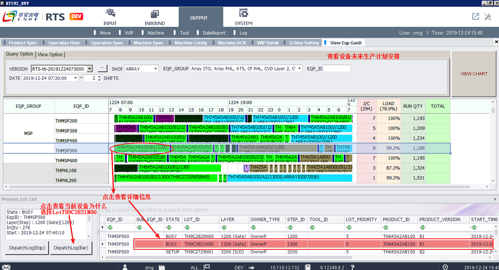

### output/result analysis

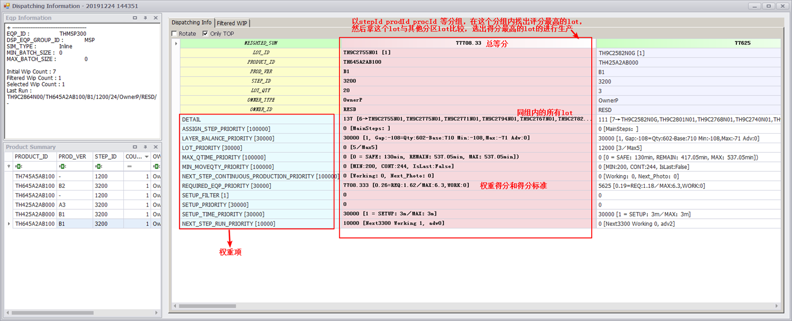

### RTS-RTD交互

1. 按规则选取排程到机台的Lot
2. 对机台 退Port t选择下一个目的地（机台）

**RTS-RTD交互**

- RTD Sorter Rule：RTD的Sorter Rule更新，RTS Plan Prioriy优先级仅次于Add Planning Lot（预约Lot）
- 把RTS预测lot，按照INPUT_PRIORITY(连续run为1，每切一次线加一)排序。如果存在与INPUT_PRIORITY = 1的LOT_ID匹配的LOT_ID，则选择该Lot进行搬送。如果不存在与INPUT_PRIORITY = 1的LOT_ID匹配的LOT_ID，则选择相同产品/站点(PFCD/operation)的LOT进行搬送
- INPUT_PRIORITY = 1的LOT搬送结束后，再选择INPUT_PRIORITY = 2的LOT进行搬送.
- 以最近的RTS PLAN为准呈现出来。每15min更新一次

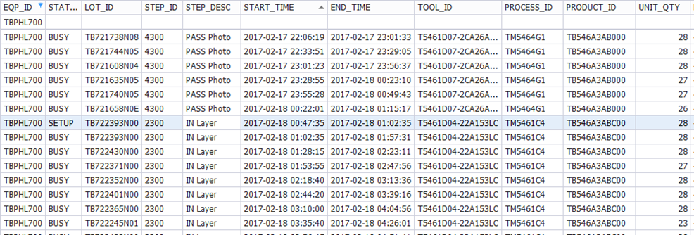

RTS-RTD交互表，包含预测Lot的产品站点版本等信息

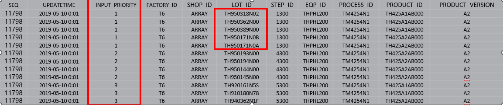

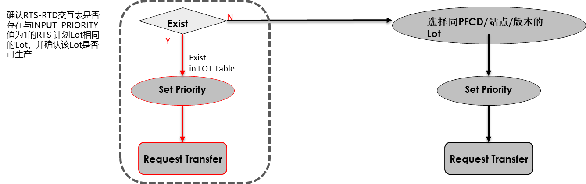

## 5 pegging

根据数据库各表之间数据的联系，创建相应的功能类实体，将各表的关键信息赋值给对应的功能类实体并进行数据的初步筛选和处理。再根据引擎的仿真等逻辑需求，创建不同的容器，保存具有相同指定属性的实体类，方便后续引擎逻辑的调用。

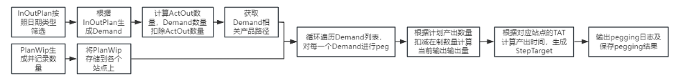

## 6 simulation

### 6.1 仿真初始化模块

#### 技术功能描述

仿真模拟前需要对初始数据进行处理，构建满足仿真要求的功能类实体，主要对EQP和LOT相关属性进行计算赋值，构建FabAoEquipment实体和FabLot实体。并生成系统事件、Lot事件及Eqp事件缓存到事件队列中。

#### 数据准备

FabAoEquipment实体创建并对属性赋值；

FabLot实体创建并对属性赋值；

获取所有的解包信息，按照解包机产能分配Lot。

### 6.2 仿真事件处理模块描述

#### 技术功能描述

通过离散事件仿真，在Dispatch 时间节点，业务过滤（Filter）对LOT进行过滤，保留符合业务规则的LOT，并通过权重（Weight）对其进行打分，将其排在EQP上并且保存PLAN。

#### 数据准备

从In_out_plan数据列表中筛选出所有有效的产品；

根据产品编号及数据表关系找到所有产品的工艺路线数据；

根据out计划时间倒推出个站点的加工时间。

### 6.3 过滤控制模块描述

#### 技术功能描述

用于过滤掉条件不满足相关业务规则的Lot，筛选出分配到备选Eqp所有有效的Lot，或在设备完成工作时选择下一个需要加工的Lot。

#### 数据准备

相关业务规则数据初始化；

过滤因子相关参数读取及初始化；

FabAoEquipment，FabLot当前时刻状态更新完成。

### 6.4 权重计算模块描述

#### 技术功能描述

用户配置一组或几组权重因子，通过权重计算方法来实现计算权重因子得分，从而使用包括预设和因子方法的权重因子信息来评估Lot的优先级。

#### 数据准备

相关业务规则数据初始化；

权重因子相关参数读取及初始化；

FabAoEquipment，FabLot当前时刻状态更新完成。

## 公共基础模块

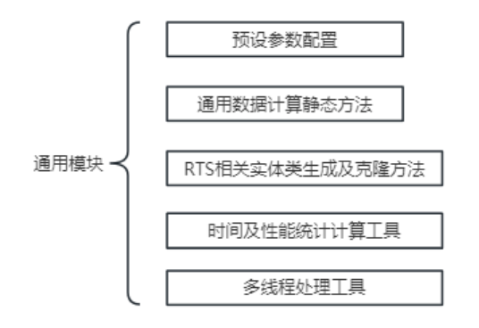
