# RTS Engine

## reference

《RTS智能排程项目软著0202-1.docx》

《RTS智能排程项目设计说明书.docx》

二者内容相同

## 1 RTS引擎工作流程

数据搜集及预处理。

仿真实体生成。

目标结果倒推（PEGGING）仿真。

模拟仿真，结合业务规则，模拟未来一段时间内工厂各机台运行情况。

结果输出，每个机台（EQP）在某段时间生产某个批次（LOT），及LOT在未来时间的移动记录等。

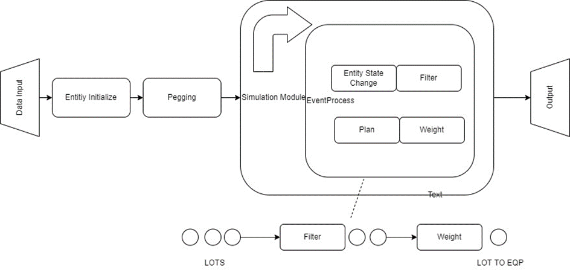

## 2 代码结构

├─Simulation

│ │

│ ├─DataModel # 数据模型模块，引擎在仿真中需要用到的实体，他们的状态变化表示了真实工厂中的状态变化。

│ │   AcidDensity.cs

│ │   ActMovePegInfo.cs

│ │   ActMoveSupply.cs

│ │   ActPegInfo.cs

│ │   AdmConstantGroup.cs

│ │   AdmConstantInfo.cs

│ │   BackupInfo.cs

│ │   BatchInfo.cs

│ │   BranchStepInfo.cs

│ │   ChamberInfo.cs

│ │   ConfigGroup.cs

│ │   ConfigInfo.cs

│ │   Constants.cs

│ │   CrossFloorInfo.cs

│ │   CurrentArrange.cs

│ │   CurrentDispatchInfo.cs

│ │   DashboardMaster.cs

│ │   DataModel.cs

│ │   DcnBucket.cs

│ │   DcnMaster.cs

│ │   DcnPlan.cs

│ │   DcnTarget.cs

│ │   EntityDispatchInfo.cs

│ │   EnumData.cs

│ │   EqpArrangeInfo.cs

│ │   EqpArrangeSet.cs

│ │   EqpCFFastSwitchInfo.cs

│ │   EqpDispatchInfo.cs

│ │   EqpRecipeInfo.cs

│ │   EqpStatusInfo.cs

│ │   EqpUsingPRTypeInfo.cs

│ │   FabAoEquipment.cs

│ │   FabEqp.cs

BLL

│ EventProcess.cs # 事件模拟模块，在整个仿真过程中，处理旧事件，生成新事件，使事件循环进行下去以达到仿真目的。

├─BOP #工艺路径模块，负责构建模拟生产中的工艺路径。

│   BopBuilder.cs

│   BopHelper.cs

│

├─Common 公用帮助模块，用于快速构建KEY值，获取默认配置值，加快快发速度。

│   AdmConstantHelper.cs

│   CompareHelper.cs

│   ConfigHelper.cs

│   CreateHelper.cs

│   OtherLcdHelper.cs

│   ShopCalendar.cs

│   SiteConfigHelper.cs

│   SiteConstantHelper.cs

│   TimeHelper.cs

│

├─Concurrence #多线程处理模块，在程序运行中，对部分函数进行多线程数据处理，效率

│   ConOutCollector.cs

│   ConPersistInput.cs

│   MultiThreadResetEvent.cs

│   Param.cs

│

├─DataModel #仿真实体扩展数据处理模块，当一些实体无法达成需求开发要求时，对其进行扩展的模块。

├─DataModelExt

│   EqpDispatchInfoExt.cs

│   FabEquipmentExt.cs

│   FabLotExt.cs

│   FabProcessExt.cs

│   FabProductExt.cs

│   FabStdStepExt.cs

│   FabStepExt.cs

│   WeightInfoExt.cs

│

├─InFlow #WIP推演统计模块，在仿真过程中对WIP进行实时推演，来统计过程中结果是否符合需求，并利用中间结果，可以开发一些其他定制需求。

│   InFlowAgent.cs

│   InflowManager.cs

│   InFlowMaster.cs

│   JobState.cs

│   JobState_WipProfile.cs

│   WipProfile.cs

│

├─Input # 输入模块，对获得的数据进行缓存和生成实体的模块。

│   AssignConstantParameter.cs

│   BuildData.cs

│   BuildDataAcid.cs

│   BuildDataExt.cs

│   BuildDataInf.cs

│   Configure.cs

│   InputMart.cs

│   InputMartAcid.cs

│

├─Logic #仿真控制模块，构建整个仿真的事件处理逻辑，对实体状态进行修改，以及权重控制。

│   Bucket.cs

│   CustomEvents_CalcInflowProfile.cs

│   CustomEvents_OnHour.cs

│   DispatcherControl.cs

│   EqpEvents.cs

│   EqpInit.cs

│   EventInit.cs

│   │   FactoryEvents.cs

│   Process.cs

│   Queue.cs

│   Route.cs

│   SetupControl.cs

│   TransferControl.cs

│   Weights.cs

│   WipInit.cs

├─Master #定制业务模块，根据工厂的客制化开发需求，将需求分类放在不同文件下进行处理，并将其使用在控制模块中。

│   AcidMaster.cs

│   BottleneckWipMaster.cs

│   BranchStepMaster.cs

│   CFFastSwitchConditionMaster.cs

│   ChamberMaster.cs

│   CrossFloorMaster.cs

│   DownMaster.cs

│   EqpArrangeMaster.cs

│   EqpMaster.cs

│   EqpRecipeTimeMaster.cs

│   EqpReserveWipMaster.cs

│   FixedEqp4StepMaster.cs

│   HoldMaster.cs

│   LoadableFilterMaster.cs

│   MachineRecipeMaster.cs

│   MainRunProductMaster.cs

│   MaskLifeMaster.cs

│   MaskMaster.cs

│   MoveTargetMaster.cs

│   OemMaster.cs

│   PMhelper.cs

│   PmMaster.cs

│   QTimeMaster.cs

│   ReleasePlanMaster.cs

│   ReworkMaster.cs

│   RunStateMasterFunc.cs

│   SampleRuleMaster.cs

│   SampleTestMaster.cs

│   SetupMaster.cs

│   StepCapacityMaster.cs

│   StepPlanManager.cs

│   TactTimeMaster.cs

│   TransferMaster.cs

│   TWorkMaster.cs

│

├─Output #输出模块，对整个仿真过程中产生的数据结果进行缓存，处理，并传输。

│   CollectData.cs

│   ErrHist.cs

│   OutCollector.cs

│   OutputMart.cs

│   ResultToMes.cs

│

│

├─PeggingImpl # 倒推模块，对计划倒推成每个时间节点需要完成的目标，对仿真中的权重控制进行参考。

│   PegControl.cs

│   PegMaster.cs

## 3 使用说明

### 3.1. 接口说明

目的：方便业务人员对接口进行配置，本地配置文件GTRSSeting.Data保存了是否保存Inbound/RTS文件、保存Inbound/RTS文件路径、厂别、数据库IP、PORT、UserId和Password、排程版本、是否执行Inbound过程、是否执行引擎计算过程和是否显示界面等信息，RTS引擎从GTRSSeting.Data中获取到配置信息进行业务处理，如保存Inbound/RTS文件，通过SqlSugarClien框架连接远程数据库，并从数据库中获取获取/新增数据等。

流程：

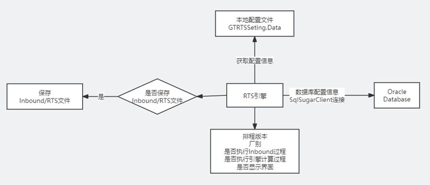

图 3-1 配置文件流程图

**步骤：**

1. 获取数据库连接信息，从本地GTRSSeting.Data配置文件中获取数据库IP、PORT、UserId和Password，通过SqlSugarClient框架远程连接数据库。

<t_GTRTSSeting>

  `<fCode>`DBConnectString `</fCode>`

  `<fDesc>`RTS数据库连接 `</fDesc>`

`<fValue>`Data Source=(DESCRIPTION=(ADDRESS=(PROTOCOL=TCP)(HOST=xxx.xx.xx.xx)(PORT=xxx))(CONNECT_DATA=(SERVICE_NAME=xxx)));User Id=xxx;Password=xxx `</fValue>`

</t_GTRTSSeting>

2. 获取厂别配置信息。

<t_GTRTSSeting>

  `<fCode>`Factory `</fCode>`

  `<fDesc>`厂别 `</fDesc>`

  `<fValue>`xx `</fValue>`

 </t_GTRTSSeting>

3. 获取保存Inbound文件路径配置信息

<t_GTRTSSeting>

  `<fCode>`inboundfilepath `</fCode>`

  `<fDesc>`保存Inbound文件路径 `</fDesc>`

  `<fValue>`xxx `</fValue>`

 </t_GTRTSSeting>

4. 获取保存RTS文件路径配置信息

<t_GTRTSSeting>

  `<fCode>`rtsfilepath `</fCode>`

  `<fDesc>`保存RTS文件路径 `</fDesc>`

  `<fValue>`xxx `</fValue>`

 </t_GTRTSSeting>

5. 是否执行Inbound过程

<t_GTRTSSeting>

  `<fCode>`IfRunInboundProg `</fCode>`

  `<fDesc>`是否执行Inbound过程 `</fDesc>`

  `<fValue>`True `</fValue>`

 </t_GTRTSSeting>

6. 是否执行引擎计算过程

 <t_GTRTSSeting>

  `<fCode>`IfRunEngCalc `</fCode>`

  `<fDesc>`是否执行引擎计算过程 `</fDesc>`

  `<fValue>`True `</fValue>`

 </t_GTRTSSeting>

7. 排程版本

 <t_GTRTSSeting>

  `<fCode>`VersionNo `</fCode>`

  `<fDesc>`排程版本 `</fDesc>`

<fValue />

 </t_GTRTSSeting>

8. MES数据库连接

<t_GTRTSSeting>

  `<fCode>`MESDBConnectString `</fCode>`

  `<fDesc>`MES数据库连接 `</fDesc>`

  `<fValue>`Data Source=(DESCRIPTION=(ADDRESS=(PROTOCOL=TCP)(HOST=xxx.xx.xxx.xx)(PORT=xxx))(CONNECT_DATA=(SERVICE_NAME=xxx)));User Id=xxx;Password=xxx `</fValue>`

 </t_GTRTSSeting>

9. 是否产生Inbound本地文件

 <t_GTRTSSeting>

  `<fCode>`ifgeninboundfile `</fCode>`

  `<fDesc>`是否产生Inbound本地文件 `</fDesc>`

  `<fValue>`True `</fValue>`

 </t_GTRTSSeting>

10. 是否产生RTS本地文件

<t_GTRTSSeting>

  `<fCode>`ifgenrtsfile `</fCode>`

  `<fDesc>`是否产生RTS本地文件 `</fDesc>`

  `<fValue>`True `</fValue>`

 </t_GTRTSSeting>

11. 是否显示界面

<t_GTRTSSeting>

  `<fCode>`ifshowform `</fCode>`

  `<fDesc>`是否显示界面 `</fDesc>`

  `<fValue>`True `</fValue>`

 </t_GTRTSSeting>

### 3.2. 输入数据说明

目的：业务人员通过智能排程系统新增/修改输入数据，并保存到数据库，RTS引擎从数据库读取更新后的数据，通过生成策略和规则进行实时排程。

RTS引擎使用的数据库工具是SqlSugar,它是一款老牌.NET 开源多库架构ORM框架（EF Core单库架构），由果糖大数据科技团队开发。

SqlSugar的优点：

1、高性能 ,不夸张的说，去掉Sql在数据库执行的时间，SqlSugar是EF数倍性能，另外在批量操作和一对多查询上也有不错的SQL优化；

2、高扩展性 ，支持自定义拉姆达函数解析、扩展数据类型、支持自定义实体特性，外部缓存等；

3、稳定性和技术支持， 虽然不是官方ORM, 但在稳定性上也是有着数年用户积累，如果遇到问题可以在GITHUB提出来，会根据紧急度定期解决；

4、功能全面，虽然SqlSugar小巧可功能并不逊色于EF框架。

流程：

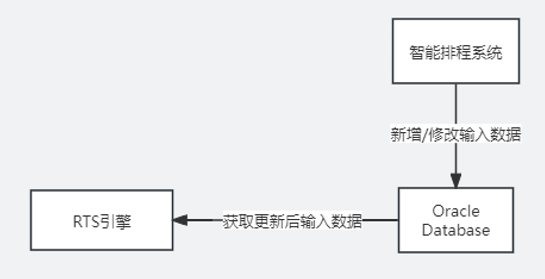

图 3-2 输入数据流程图

主要输入数据：

| 表名               | 简介                         |
| ------------------ | ---------------------------- |
| ENG_EQP            | EQP信息表                    |
| ENG_EQP_ARRANGE    | EQP加工产品站点信息表        |
| ENG_EQP_CHAMBER    | EQP多腔式信息表              |
| ENG_CONFIG         | 配置信息表                   |
| ENG_HOLD_TIME      | Lot Hold Time信息表          |
| ENG_ACID_ALTER     | 酸信息表                     |
| ENG_IN_OUT_DPS     | 投入产出计划信息表（长版本） |
| ENG_IN_OUT_PLAN    | 投入产出计划信息表（短版本） |
| ENG_PRESET_INFO    | 权重组名信息表               |
| ENG_PROCSTEP       | 工艺站点信息表               |
| ENG_PRODUCT        | 产品信息表                   |
| ENG_SETUP_TIMES    | 切换时间信息表               |
| ENG_TAT            | 周转时间信息表               |
| ENG_MASK           | Mask信息表                   |
| ENG_WEIGHT_FACTORS | 权重因子信息表               |
| ENG_WEIGHT_PRESETS | 权重因子设置信息表           |
| ENG_WIP            | WIP信息表                    |
| ENG_WIP_STAY_HOURS | WIP Qtime信息表              |
| INF_MACHINE_RECIPE | 设备RUN产品信息表            |

新增输入数据步骤：

以新增权重因子设置表举例说明：

| **序号** | **字段名称** | **字段说明** | **字段类型** | **字段长度** | **是否主键** | **属性** |
| -------------- | ------------------ | ------------------ | ------------------ | ------------------ | ------------------ | -------------- |
| 1              | VERSION_DATE       | 版本时间           | datetime           | 7                  | 否                 | 非空           |
| 2              | VERSION_ON         | 版本号             | VARCHAR            | 64                 | 否                 | 非空           |
| 3              | PRESET_ID          | 机台组IG           | CARCHAR            | 64                 | 是                 | 非空           |
| 4              | FACTOR_ID          | 权重因子ID         | VARCHAR            | 64                 | 是                 | 非空           |
| 5              | FACTOR_TYPE        | 权重因子类型       | VARCHAR            | 64                 | 否                 |                |
| 6              | FACTOR_NAME        | 权重因子名称       | VARCHAR            | 64                 | 否                 |                |
| 7              | ORDER_TYPE         | 排序类型           | VARCHAR            | 64                 | 否                 |                |
| 8              | CRITEIA            | 权重               | VARCHAR            | 64                 | 否                 |                |
| 9              | ALLOW_FILTER       | 允许过滤           | VARCHAR            | 64                 | 否                 |                |
| 10             | FACTOR_WEIGHT      | 权重值             | float              | 8                  | 否                 |                |
| 11             | SEQUENCE           | 优先级             | float              | 8                  | 否                 |                |
| 12             | UPDATE_TIME        | 更新时间           | Timestamp          | 8                  | 否                 |                |

1. RTS引擎增加ENG_WEIGHT_PRESETS属性类。

ENG_WEIGHT_PRESETS类包括VERSION_DATE、VERSION_NO、PRESET_ID、PFACOR_ID、FACTOR_TYPE、FACTOR_WEIGHT、FACTOR_NAME、SEQUENCE、ORDER_TYPE、CRIFERIA、ALLOW_FILTER和UPDATE_TIME属性，与数据库字段对应。

2. RTS引擎增加IDA_ENG_WEIGHT_PRESETS接口类。

类中定义GetList接口，参数为查询条件，返回值为ENG_WEIGHT_PRESETS实例列表。

3. RTS引擎增加DA_ENG_WEIGHT_PRESETS实体类。

DA_ENG_WEIGHT_PRESETS类继承TRTS_DbContext和IDA_ENG_WEIHT_PRESETS，TRTS_DbContext是数据库操作类，用于连接和获取数据库信息。

4. 调用DA_ENG_WEIGHT_PRESETS实例GetList接口获取输入数据。

调用GetList接口可返回输入数据列表。

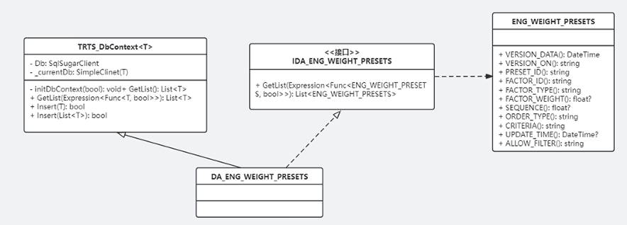

图 3-3 DA_ENG_WEIGHT_PRESETS UML类图

### 3.3. 数据预处理

目的：根据数据库各表之间数据的联系，创建相应的功能类实体，将各表的关键信息赋值给对应的功能类实体并进行数据的初步筛选和处理。再根据引擎的仿真等逻辑需求，创建不同的容器，保存具有相同指定属性的实体类，方便后续引擎逻辑的调用。

步骤：

1. 获取数据：从数据库读取到数据，根据各表字段的集合使用SqlSugar相关API完成数据到实体类的映射，并缓存数据；
2. Pegging：目的是根据生产的投入产出计划表中的计划产出日期，倒推出对应产品在每一个站点需要产出的个数和产出时间，作为后续仿真模拟过程中Eqp选择Lot的参考依据之一。

Pegging逻辑处理主要包含Pegging和Move Target Pegging，两种逻辑的数据来源不同，Pegging的初始数据表为ENG_IN_OUT_PLAN，Move Target Pegging的初始数据表为ENG_MOVE_TARGET。两种逻辑流程大致相同，主要流程图。

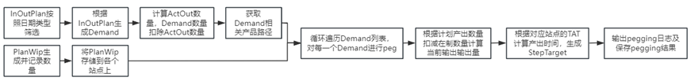

### 3.4. 仿真初始化

目的：仿真模拟前需要对初始数据进行处理，构建满足仿真要求的功能类实体，主要对EQP和LOT相关属性进行计算赋值，构建FabAoEquipment实体和FabLot实体。

步骤：

1. FabAoEquipment实体初始化：根据系统权重配置信息，给对应Eqp对应的FabAoEquipment实体对应属性赋值，初始化Eqp对应的腔室信息以及获取Eqp初始状态信息，流程如图。

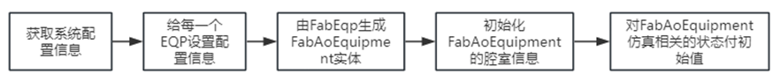

2. FabLot实体初始化：获取所有的Wip列表，转换成FabLot对象，并对FabLot相关属性进行初始化和赋值，具体流程如图。

3. ReleasePlan初始化：获取所有的解包信息，按照解包机产能分配Lot，生成投产事件，流程如图。

4. 系统事件初始化：主要包含开始时初始事件、每日切换事件、每小时事件、每十分钟全局过滤事件、长版本定时输出日志事件、解包事件及定制化事件等。添加事件的主要逻辑是，首先确定事件的开始时间，创建对应类型的事件实体对象，将改事件实体对象添加到事件列表中。
5. Lot事件初始化：主要包含RunLot事件初始化和HoldLot事件初始化。HoldLot事件初始化的主要流程是从所有Lot的列表中找出状态为Hold的lot，创建这些Lot的Hold事件并添加到事件列表中。在创建该事件后，还需要创建对应Lot的CurrentFabPlan，并赋值。RunLot事件初始化流程较为复杂，主要流程如图。

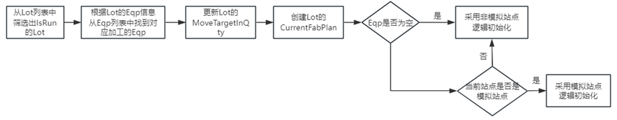

6. Eqp事件初始化：包含DownEqp事件初始化、PmEqp事件初始化及OtherEqp事件初始化。DownEqp事件初始化和PmEqp事件初始化类似，流程如下：

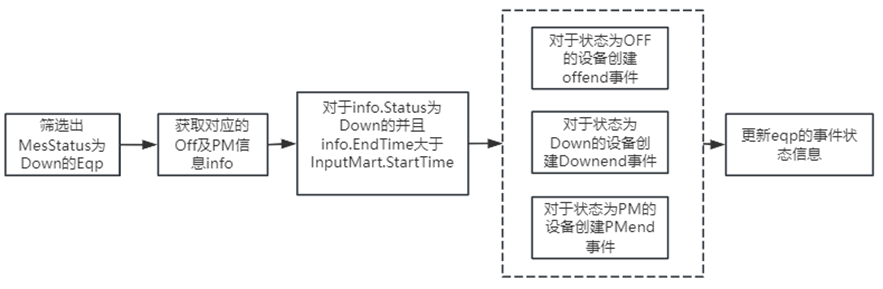

OtherEqp事件初始化流程如下：

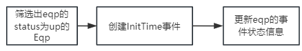

### 3.5. 仿真模拟

目的：通过离散时间仿真，在Dispatch 时间节点，业务过滤（Filter）对LOT进行过滤，保留符合业务规则的LOT，并通过权重（Weight）对其进行打分，将其排在EQP上并且保存PLAN。

步骤：

1. 当前EventTime的前处理：获取当前EventTime，调用Reset方法并为有效的EQP重新创建新的EqpDispatchInfo；获取当前EventTime下的所有Event，根据事件类型进行处理。
2. 关键事件的处理：工作日切换时，更改仿真日期，重置需要每天更新的约束。DCN解包能力释放时，需要重新计算投产信息。
3. 不同场景的状态更新：包含初始非LastRunWip的场景、Lot事件的场景、ReleaseLot事件的场景、Eqp事件的场景、SubEqp事件的场景。
4. 关键时间节点TrackOut的逻辑处理：包含上一任务结束时需要处理的逻辑，寻找下一站点的逻辑，创建新的PlanInfo的逻辑，更新FabLot的当前Step和当前PlanInfo的逻辑及站点切换时需要处理的逻辑。
5. 寻找到可用Lot/Eqp：寻找待排Eqp，寻找待排Lot，为每一Lot寻找可以Loadable的Eqp，为每一Eqp寻找可以Loadable的Lot。
6. 选择Lot：先排Port口中Wip，预过滤Lot，过滤Lot，更新变量，添加DummyLot，计算各个权重因子的得分（Weights），评估（排序），选择排在首位的Lot作为被选Lot。
7. 特殊事件的处理：对相关联的TrackOutEvent的属性做更新。
8. 关键时间节点TrackIn的逻辑处理：更新Eqp连续加工某一产品的数量、根据PFCDAutoChange更新lot部分属性、更新PlanInfo的部分属性，如TrackInTime等、ChangeWipLocation，便于统计InFlowQty、Mask的属性更新，如Mask添加新的LoadInfo、更新StepTarget的RemainQty。
9. ParallelChamber特殊场景的处理：ParallelChamber在相同时间内，可以TrackIn多个Lot的场景。
10. 产能占用/Dispatch后处理：非模拟站点的Dispatch后处理、InLine类型的Dispatch后处理、ParallelChamber类型的Dispatch后处理、Eqp下各SubEqp的产能占用逻辑、在开始后处理时，需要处理的逻辑、记录派送日志DispatchLog、创建新的事件、将lot的当前PlanInfo设置为Eqp的LastPlan。

### 3.6. 过滤控制说明

目的：用于选择分配到备选Eqp的新Lot，或在设备完成工作时选择下一个需要加工的Lot。

步骤：

1. Prefilter处理：获取到当前EventTime该Eqp匹配的所有Lot，根据Lot的状态筛选出所有WAIT的Lot。
2. 创建Eqp的派送信息：创建仿真的Eqp该EventTime的CurrentDispatchInfo并初始化基础属性值，以便记录Filter过程中的重要信息。
3. DoFilter初始过滤：主要过滤掉条件不满足相关业务规则的Lot，如TransferTime、EqpArrange、ToolArrange等条件。
4. DoFilter硬约束过滤：硬约束是基于参考信息的约束，不可重复注册，主要包含LotGroup约束、Eqp腔室条件约束、Eqp配方条件约束、定Run约束、OwnerLimit约束、PreventLayerChange约束、酸浓度约束等等。
5. DoFilter软约束过滤：软约束是基于操作方式的约束，主要通过用户配置过滤因子，再通过相应的业务逻辑来判断Lot是否能在Eqp加工。根据过滤因子配置表中的信息来判断Eqp是否拥有相应的过滤因子，如果当前仿真Eqp不具备该过滤因子，那么该约束对当前Eqp不起作用。过滤因子配置信息如下：

| ALLOW_SMALL_LOT_FILTER      | 在一定条件下判断被过滤掉的小lot可以允许再次继续使用               |
| --------------------------- | ----------------------------------------------------------------- |
| CHANGE_LINE_GROUP_FILTER    | By Group过滤                                                      |
| CONTINUOUS_SMALL_LOT_FILTER | 避免连续run小片                                                   |
| CONTROL_PROD_WIP_FILTER     | 控制部分产品的QTime的Wip卡控                                      |
| CROSS_FLOOR_FILTER          | 过滤不允许跨楼层的LOT                                             |
| EQP_RESERVE_WIP_FILTER      | 机台路径限制，机台预留wip，保证设备利用最大化                     |
| FIXED_EQP_4STEP_FILTER      | 针对WET/STR 机台定run的过滤                                       |
| GB_OPT_WET_ACID_FILTER      | Gurobi 算法模型分配机台的引擎过滤因子                             |
| LAYER_BALANCE_FILTER        | x800 站点 安全站点控wip水位                                       |
| MANUAL_ADJUST_FILTER        | 代工和手动调整                                                    |
| MASK_LIFE_FILTER            | 检验Eqp的Masklife是否超过产品Masklife限制，ITO使用                |
| NEW_EQP_ASSIGN_FILTER       | 对于一只产品是否需要再开一台机run的Filter                         |
| NEXT_BOTTLENECK_WIP_FILTER  | CVD wip水位决定OST定RUN                                           |
| OEM_FILTER                  | T2 当设备Idle时排给t1 代工的产品                                  |
| PREVENT_LAYER_CHANGE_FILTER | 阻止不同层别切换的Filter                                          |
| REWORK_LOT_FILTER           | 根据可Run的机台及WIP量评估WET/STR是否堆货，如果堆货则不Run RW站点 |
| SETUP_FILTER                | 防止长时间切线的Filter                                            |
| STOCKER_LOCK_FILTER         | LOW WIP减少跨楼层                                                 |
| TACT_TIME_FILTER            | 考量TT安排PHL调度，TACT TIME 差异过大过滤                         |

### 3.7. 权重配置说明

目的：用户配置一组或几组权重因子，通过权重计算方法来实现计算权重因子得分，从而使用包括预设和因子方法的权重因子信息来评估Lot的优先级。

权重配置包含了权重因子、权重预设、权重计算方法等概念。

权重因子是用于评估每个Lot的优先级顺序的评估因素。如果Lot是通过FIFO机制调度的，则可以指定权重因子来比较Lot卡组内对应站点的完成时间。通常在高新技术产业的生产现场有至少3~4个或多达10~20个评估因素来评估批次优先级。

权重预设是调度过程中使用的一组权重系数。这是一个数据集，包括Factors之间的优先级或根据Dispatcher Type的Factor属性的信息。由于调度可以根据设备进行不同的处理，因此实际站点中的预设可以有1到几个元素，因为每个设备类型可以分配不同的预设值。此外，设备的基础信息还需要配置设备要使用的预设和调度。

权重方法是用于计算权重因子的评估结果的函数。为了计算系数的值，需要与预设中系数的批次、设备和特性相关的一些信息。当应用Dispatcher时，必须提前实现组成Preset的权重因子的Factor方法，引擎库中的仿真模块可以通过Weights函数定义Factor方法。

步骤：

1. Lot分组：获取Eqp当前EventTime的Lot派送信息列表，根据每条Lot派送信息携带sample信息筛选出所有的有效的Lot。
2. DummyLot逻辑处理：判断当前Eqp是否是Setup状态，如果是则需要考虑dummyLot的场景，生成dummyLot并将添加到待排的列表中。
3. 计算Lot权重得分：遍历可排Lot列表，根据Eqp对应的权重因子组，计算Lot的每一个权重因子的得分。
4. 选择派送Lot：根据可排Lot列表中得分总和排序，选择得分最高的Lot，如果是dummyLot，返回空值，然后设置IsDummyWait为True，否则正常派送。

引擎中的所使用到的主要权重因子如下：

| **分类**                           | **因子****ID**                                                                                                                | **因子描述**                                                        |
| ---------------------------------------- | ----------------------------------------------------------------------------------------------------------------------------------- | ------------------------------------------------------------------------- |
| 防止机台IDLE                             | LOT_LOCATION_PRIORITY                                                                                                               | 针对Wip中的Wait Lot， 如果位置在机台的相邻STK上，则得分                   |
| 机台分配                                 | LAYER_BALANCE_PRIORITY                                                                                                              | 对于可以跑不同层别的机台，根据不同层别的WIP数量的多少决定机台去跑哪个层别 |
| REQUIRED_EQP_PRIORITY                    | 根据WIP数量判断需要机台数量，某只产品WIP数量越多，所需机台越多，得分越高                                                            |                                                                           |
| LAYER_BALANCE_FOR_PHOTO                  | 针对于PHL前站点的机台设置的不同层别平衡的权重，类似于Layer Balance  Priority                                                        |                                                                           |
| 满足瓶颈run货                            | NEXT_STEP_RUN_PRIORITY                                                                                                              | 依据一下站点run货情况来给优先级                                           |
| NEXT_STEP_CONTINUOUS_PRODUCTION_PRIORITY | 下一PHL站点的Wip状况的权重，优先保证PHL Run货                                                                                       |                                                                           |
| 切换线                                   | ALLOW_RUN_DOWN_TIME                                                                                                                 | 机台可以IDLE等前面WIP到站，减少切换线                                     |
| MASK_MOVE_PREVENT_PRIORITY               | 阻止Mask切换权重，如果排的Lot不需要切换Mask，则得分，需要切换Mask则不得分                                                           |                                                                           |
| MIN_MOVEQTY_PRIORITY                     | 机台最小Move数量，如果机台已连续run超过维护的机台最小Move数量，则不得分，否则得分；减少切换线                                       |                                                                           |
| PREVENT_LAYER_CHANGE_PRIORITY            | 对于可以跑不同层别的机台，如果需要切层别则不得分                                                                                    |                                                                           |
| SETUP_PRIORITY                           | 如果不需要切换线，小于要作业的时间，则得分                                                                                          |                                                                           |
| SETUP_TIME_PRIORITY                      | 切换线时间权重，根据切换线时间的长短决定分数的高低                                                                                  |                                                                           |
| MAX_MOVE_LIMIT_PRIORITY                  | 机台最大Move数量，如果机台已连续run超过维护的机台最大Move数量，则不得分，否则得分；                                                 |                                                                           |
| 尾批快跑                                 | SMALL_BATCH_MERGE_PRIORITY                                                                                                          | 针对尾批如果落后主货批设定的站点数量，则得分                              |
| 优先run                                  | LOT_PRIORITY                                                                                                                        | 关于Lot priority的优先级，2等级得分最高，3等级次之，5等级不得分           |
| OWNER_TYPE_PRIORITY                      | 和特定的OwnerType一样的情况给与较高优先级。Criteria如维护OwnerE，则OwnerE的Lot得分                                                  |                                                                           |
| MAX_QTIME_PRIORITY                       | 对于Q time剩余时间较少的给与较高的优先级，同时考虑当剩余时间还很充裕的情况下，Q time不成为较大的限制。（对于快要Q time的Lot，得分） |                                                                           |
| ASSIGN_STEP_PRIORITY                     | 机台优先特定站点权重，如果Lot的站点是机台Machine Spec中维护的ASSIGH_STEP，则得分                                                    |                                                                           |
| CU_DENSITY_3402                          | WET机台群组对于3402站点，在指定铜离子浓度时，给高优先级                                                                             |                                                                           |
| MAIN_RUN_PRODUCT_PRIORITY                | 主run产品的优先级，如果产品是维护的主run产品，则得分                                                                                |                                                                           |
| ASSIGN_EQP_PRIORITY                      | 根据lot的当前站点来决定当前Eqp的优先级，优先级高的得分高                                                                            |                                                                           |
| Move Target                              | STEP_TARGET_PRIORITY                                                                                                                | 按照出货计划和TAT进行倒推时，如果目标产品在此站点Move落回于Target，则得分 |

### 3.8. 业务拓展说明

目的：为满足各工厂间不同的业务需求，需要开发特定的业务逻辑，来优化引擎仿真模拟的结果。

一般实施流程：

实施步骤：

以增加跨楼层需求为例

1. 确定业务规则及逻辑：客户经理与厂端技术人员，根据实际生产情况，确定跨楼层业务规则以及程序中实施的逻辑。

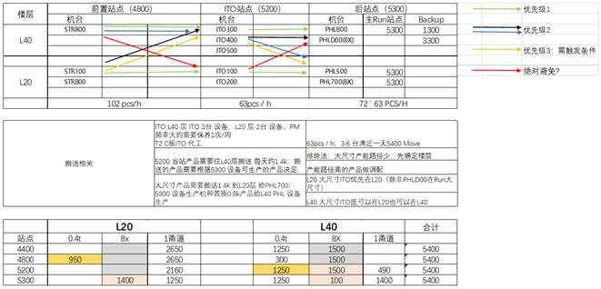

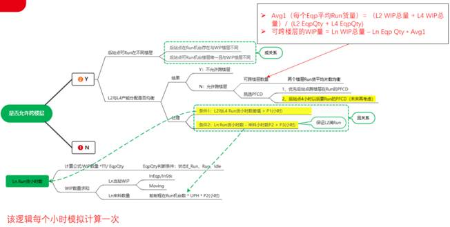

2. 业务数据处理：客户经理与开发人员根据业务需求确定数据来源及数据格式并存入数据库。

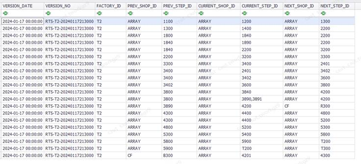

3. 数据类及数据导入：在代码中新建数据表匹配的数据类ENG_CROSS_FLOOR_STEP_CONFIG，以及功能类CrossFloorInfo和CrossFloorMaster，并编写数据导入方法Build_CrossFloorStepConfig()方法。
4. 数据计算：在CrossFloorMaster中编写跨楼层数据初始化方法，以及业务规则处理方法，计算出指定的Eqp跨楼层相关的信息，以便后续仿真使用。
5. 数据使用：用户添加跨楼层过滤因子，开发人员根据业务逻辑编写跨楼层过滤方法，仿真过程中，相关的Eqp会调用跨楼层过滤方法，利用CrossFloorMaster中计算的数据来决策当前Lot是否可派送。

### 3.9. 输出数据说明

目的：RTS引擎将排产结果和LOG写入到数据库，智能排程系统从数据库中读取结果信息进行列表/甘特图展现。

流程：

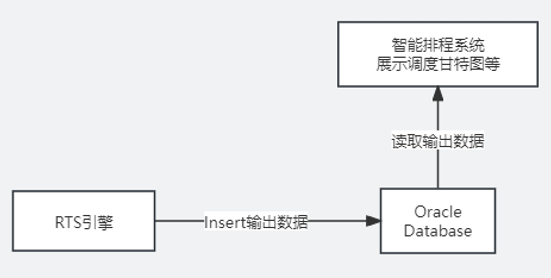

图 3-4 输出数据流程图

主要输出数据：

| 表名                 | 简介           |
| -------------------- | -------------- |
| RSL_EQP_PLAN         | EQP计划记录    |
| RSL_EQP_DISPATCH_LOG | EQP派送LOG记录 |
| RSL_LOT_HISTORY      | LOT历史记录    |
| RSL_MAIN_RUN_LOG     | 主任务LOG记录  |
| RSL_MASK_HISTORY     | Mask历史记录   |
| RSL_ACID_DENSITY_LOG | 酸度LOG记录    |
| RSL_LOADED_DEMAND    | 排产需求记录   |
| RST_UNPEG_HISTORY    | 解包历史记录   |
| RSL_QTIME_HISTORY    | QTIME历史记录  |

输出数据步骤：

以RSL_EQP_PLAN表举例说明：

1. RTS引擎将Eqp排产计划保存到OutputMart.EqpPlan列表。
2. 调用BulkCopyUtil.Insert接口，传入OutputMart.EqpPlan信息。
3. 使用Sqlsugar框架获取RSL_EQP_PLAN对应的属性名。
4. 使用表名、属性名和实体类对应的数据列表组装为SQL语句。
5. 使用OracleCommnad接口执行SQL语句，将输出数据写入数据库。
6. 智能排程系统读取数据库中输出数据，通过列表和甘特图等方式展示。
