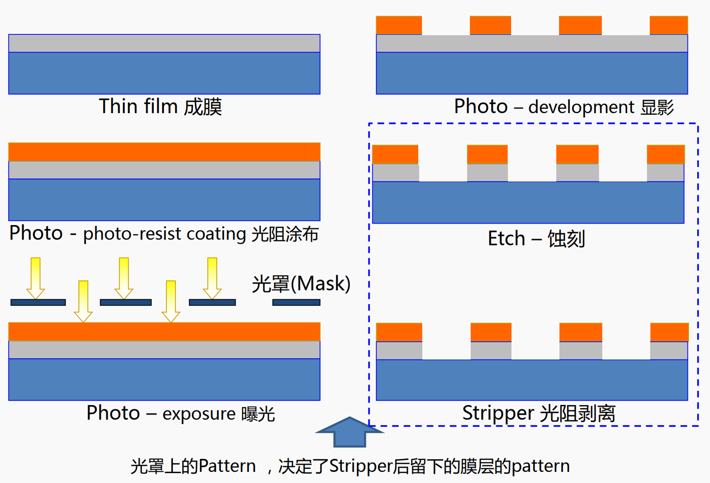

# TFT-LCD制程基础学习总结

## reference

《TFT-LCD制程基础学习总结.pptx》

## 1 Array 制程工艺简介

## 2 Glossary

| 生产厂（Fab）                                     | 整个ARRAY制造系统生产线可以简称为Fab                                                                                                                                                                                                                                                                                                                                                                                         |
| ------------------------------------------------- | ---------------------------------------------------------------------------------------------------------------------------------------------------------------------------------------------------------------------------------------------------------------------------------------------------------------------------------------------------------------------------------------------------------------------------- |
| 晶片（Wafer）                                     | 晶片是TFT-LCD制造业最基本的加工单元，第五代TFT-LCD生产线可投入1000mm×1200mm和1100mm×1300mm两种晶片                                                                                                                                                                                                                                                                                                                         |
| 批（Lot）                                         | Lot一般由几十个Wafer（20或者50个）叠加起来组成，TFT-LCD生产中，基本以Lot为加工单位                                                                                                                                                                                                                                                                                                                                           |
| 加工机台（EQ）                                    | 生产加工线上的设备，几个相同的机台组成机台组（EQ  Group）                                                                                                                                                                                                                                                                                                                                                                    |
| 晶盒（Cassette）                                  | 用来装Wafer的盒子，由一个个分离的插槽组成。一般一个晶盒可以放20片Wafer，即一个Lot。加工时都是将Cassette投入到生产线中，由机械手负责完成Lot在EQ和Cassette中的交换。ARRAY制造系统共投入1500个Cassette，循环利用，即当Cassette内的Lot经历过全部加工工艺后，空Cassette沿生产线回流至投料处，重新装入未加工的Lot并投入到生产线中                                                                                                  |
| 在制品（Work  In Process，WIP）                   | 指的是工作中心在制品区，为工作中心提供原材料、完成产品、半成品的存储货位                                                                                                                                                                                                                                                                                                                                                     |
| 存储区（Stocker）                                 | 存放晶盒的仓库，WIP暂存于存储区里。一个Bay对应着一个Stocker，每个存储区内分布着几百个储位，Bay内的加工机台共用这些储位                                                                                                                                                                                                                                                                                                       |
| 设备的出入口（Port）                              | 每个加工机台都有2-4个Port，用于暂存Cassette                                                                                                                                                                                                                                                                                                                                                                                  |
| 化学气相沉积  （Chemical  Vapor Deposition，CVD） | 化学气相沉积（Chemical  Vapor Deposition，CVD）指化学气体或蒸汽在基质表面反应合成涂层或纳米材料的方法，是半导体工业中应用最为广泛的用来沉积多种材料的技术，包括大范围的绝缘材料，大多数金属材料和金属合金材料。从理论上来说，它是很简单的：两种或两种以上的气态原材料导入到一个反应室内，然后他们相互之间发生化学反应，形成一种新的材料，沉积到晶片表面上。沉积氮化硅膜(Si3N4)就是一个很好的例子，它是由硅烷和氮反应形成的。 |
| 物理气相沉积  （Physical Vapor Deposition，PVD）  | 物理气相沉积（Physical  Vapor Deposition，PVD）技术是指在真空条件下采用物理方法将材料源（固体或液体）表面气化成气态原子或分子，或部分电离成离子，并通过低压气体（或等离子体）过程，在基体表面沉积具有某种特殊功能的薄膜的技术，  物理气相沉积是主要的表面处理技术之一。                                                                                                                                                      |

| RTS：实时排程系统（Real  Time Scheduling）                                                                                                                   |
| ------------------------------------------------------------------------------------------------------------------------------------------------------------ |
| RTD：实时生产调度（Real  Time Dispatcher）                                                                                                                   |
| MES：制造执行系统（Manufacturing  Execution System）                                                                                                         |
| DPS：每日生产计划（Daily  Production Schedule）                                                                                                              |
| DSP：实时派工系统（Dispatch，DSP）                                                                                                                           |
| WIP：在制品（work  in process）                                                                                                                              |
| Lot：批                                                                                                                                                      |
| EQ：加工机台                                                                                                                                                 |
| Port：设备的出入口。每个加工机台都有2-4个Port，用于暂存晶盒（Cassette，用来装Wafer的盒子，由一个个分离的插槽组成。一般一个晶盒可以放20片Wafer，即一个Lot）。 |
| 禁限Run：某产品某工序的可用机台信息（动态变化）。                                                                                                            |
| PHL：Photo Line， Array PHL工序                                                                                                                              |
| Etch：蚀刻                                                                                                                                                   |
| STK：存储区（Stocker）                                                                                                                                       |
| TT：节拍时间（Takt  Time）                                                                                                                                   |
| TAT：周转时间（Turn  Around Time ）                                                                                                                          |
| MASK：光罩/光掩膜版                                                                                                                                          |
| Q-time：某产品两个工序（不一定相邻）的最大间隔时间或最小间隔时间                                                                                             |
| Unpack工序？                                                                                                                                                 |
| MSP工序？                                                                                                                                                    |
| Array  PHL工序                                                                                                                                               |

## 3 Array 制造系统的特点

| 1.生产规模大，实际系统造价高  ARRAY制造系统的造价往往高达百亿人民币。同时更新换代快，其资源闲置的成本十分高昂。                                                                                                                                                                                                             |
| --------------------------------------------------------------------------------------------------------------------------------------------------------------------------------------------------------------------------------------------------------------------------------------------------------------------------- |
| 2.制造工艺复杂，生产周期较长  TFT-LCD的制造，工序繁多并且制造周期较长，工件从投入往往需要经过几十道工序，经过一周甚至更长的生产周期才能完成加工。                                                                                                                                                                           |
| 3.高度的重入性  ARRAY制造系统的多重入特点增加了生产调度控制的复杂性，也增加了指定生产计划的难度。  可重入制造系统是指在工件从投入到产出的过程中需要不只一次的在同一台设备上进行加工的生产制造系统，其显著标一记为系统中有处于不同加工阶段的工件在同一台机器前同时等待加工。这类系统中工件加工路径呈现规律性重入的典型特点。 |
| 4.随机性较大  设备对工件特定步骤的加工时间一般是固定的，但考虑到机器失效，残次品的出现和其他偶然因素，TFT-LCD的加工时间具有随机性。另外工件加工路径中的多次重使得各加工工序之间具有较大耦合性，增加了随机性。                                                                                                               |
| 5.设备按Stocker布置  ARRAY制造系统中多种不同加工设备布置于同一Stocker的Bay的两侧，共用Stocker内的储位，对于暂存于同一Stocker内的进行不同加工工序的工件进行调度重要而复杂。                                                                                                                                                  |
| 6.生产线评价指标多  ARRAY制造系统中，包括在制品数量、产出量、平均制造周期等众多评价指标，任何调度策略及优化方法必须兼顾多个指标，达到整体优化的目的，这增加了制定调度策略及建立优化策略的难度。                                                                                                                             |
